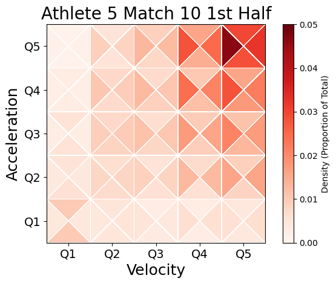

# quantile-cube

A Python package for visualizing the distribution of 3D movement data — velocity, acceleration, and angle — collapsed into a 2D heatmap.

Movement observations are binned into quantiles along three dimensions: velocity (x-axis), acceleration (y-axis), and angle of movement (the four triangles within each cell). Each triangle's color represents the density of observations — the proportion of total time spent in that specific combination of velocity, acceleration, and angle quantile. This makes it possible to see at a glance where movement is concentrated across all three dimensions simultaneously.

<p align="center">
  
</p>

---

## Table of Contents
- [Installation](#installation)
- [Quick Start](#quick-start)
- [Parameters](#parameters)
- [Advanced Usage](#advanced-usage)
- [How It Works](#how-it-works)
- [Contributing](#contributing)
- [Citation](#citation)
- [License](#license)

---

## Installation

Install from PyPI (no repo cloning needed):

```bash
pip install quantile-cube
```

**Requirements:** Python 3.9+, NumPy ≥ 1.21, Matplotlib ≥ 3.5, Pandas ≥ 1.3

If you'd like to explore the source, run examples, or contribute:

```bash
git clone https://github.com/kelanethomas/quantile-cube.git
cd quantile-cube
pip install -e .
```

---

## Quick Start

### Option 1 — Raw arrays

```python
from quantile_cube import plot_cube
import numpy as np

q1 = np.random.rand(25)
q2 = np.random.rand(25)
q3 = np.random.rand(25)
q4 = np.random.rand(25)

plot_cube(
    values=[q1, q2, q3, q4],
    M=5,
    N=5,
    title="My Quantile Cube",
    colorbar_label="Value",
    cmap="viridis",
)
```

### Option 2 — DataFrame (recommended)

If your data is in a DataFrame with columns named like `Q1_vel_Q1_acc_Q1_angle`:

```python
from quantile_cube import plot_cube

plot_cube(
    cube_data=df,
    M=5,
    N=5,
    title="Game 5 Quantile Cube",
)
```

## Parameters

| Parameter | Type | Default | Description |
|---|---|---|---|
| `values` | list of 4 arrays | `None` | One array per quantile, each of length M×N |
| `cube_data` | DataFrame | `None` | Single-row DataFrame with columns `Q{vel}_vel_Q{acc}_acc_Q{angle}_angle` |
| `M` | int | `5` | Number of columns |
| `N` | int | `5` | Number of rows |
| `minimum` | float | `0` | Colormap lower bound |
| `maximum` | float | data max rounded up to nearest 0.01 | Colormap upper bound |
| `cmap` | str or Colormap | `"Reds"` | Matplotlib colormap |
| `title` | str | `"Quantile Cube"` | Plot title and default save filename |
| `colorbar_label` | str | `""` | Colorbar label |
| `xlabel` | str | `"Velocity"` | X-axis label |
| `ylabel` | str | `"Acceleration"` | Y-axis label |
| `quantile_labels` | list of 4 str | `["Q1","Q2","Q3","Q4"]` | Triangle labels |
| `show_quantile_labels` | bool | `False` | Show label-only summary view |
| `show_values` | bool | `False` | Print numeric value at center of each triangle |
| `value_fmt` | str | `".4f"` | Format string for numeric labels when `show_values=True` |
| `grey_nonsignificant` | bool | `False` | Render NaN values in grey |
| `save` | bool | `False` | Save figure to file |
| `save_path` | str | `"<title>.png"` | Custom save path |
| `show` | bool | `True` | Call `plt.show()` |
| `figsize` | tuple | `(7, 7)` | Figure size in inches |

## Advanced Usage

### Custom axis labels

```python
plot_cube(
    values=[q1, q2, q3, q4],
    xlabel="Speed Bins",
    ylabel="Acceleration Bins",
)
```

### Custom quantile labels

```python
plot_cube(
    values=[q1, q2, q3, q4],
    quantile_labels=["Low", "Mid-Low", "Mid-High", "High"],
    show_quantile_labels=True,
)
```

### Handling non-significant values

```python
import numpy as np

q1_with_nans = np.where(pvalues > 0.05, np.nan, q1)

plot_cube(
    values=[q1_with_nans, q2, q3, q4],
    grey_nonsignificant=True,
)
```

### Saving figures

```python
plot_cube(
    values=[q1, q2, q3, q4],
    title="my_plot",
    save=True,
    save_path="outputs/my_plot.png",
    show=False,
)
```
---

## How It Works

Each cell in the grid corresponds to a (velocity, acceleration) quantile bin. Within each cell, four triangles represent four angle quantiles — encoding directional movement. Color intensity reflects the proportion of total observations falling in that bin, making relative density immediately readable across all three movement dimensions at once.

> **Tip:** Values across all triangles sum to 1.0, so the colormap reflects relative time spent rather than absolute counts.

---

## Contributing

Contributions, bug reports, and feature requests are welcome!

1. Fork the repo: [github.com/kelanethomas/quantile-cube](https://github.com/kelanethomas/quantile-cube)
2. Create a branch: `git checkout -b feature/your-feature`
3. Commit your changes and open a pull request

Please open an [issue](https://github.com/kelanethomas/quantile-cube/issues) first if you're planning a larger change.

---

## Citation

This package accompanies the following paper:

> Thomas, K. & Hannig, J. (2025). *Movement Dynamics in Elite Female Soccer Athletes: The Quantile Cube Approach*. arXiv preprint arXiv:2503.11815. https://arxiv.org/abs/2503.11815
>
> *Accepted at the Journal of Quantitative Analysis in Sports — full publication coming soon.*

```bibtex
@misc{thomas2025quantilecube_paper,
  author = {Thomas, Kendall and Hannig, Jan},
  title  = {Movement Dynamics in Elite Female Soccer Athletes: The Quantile Cube Approach},
  year   = {2025},
  eprint = {2503.11815},
  archivePrefix = {arXiv},
  url    = {https://arxiv.org/abs/2503.11815},
}
```

To also cite the software package:

```bibtex
@software{thomas2026quantilecube_pkg,
  author  = {Thomas, Kendall},
  title   = {quantile-cube: 3D Movement Distribution Visualization},
  year    = {2026},
  url     = {https://github.com/kelanethomas/quantile-cube},
  version = {0.1.0},
}
```

---

## License

MIT